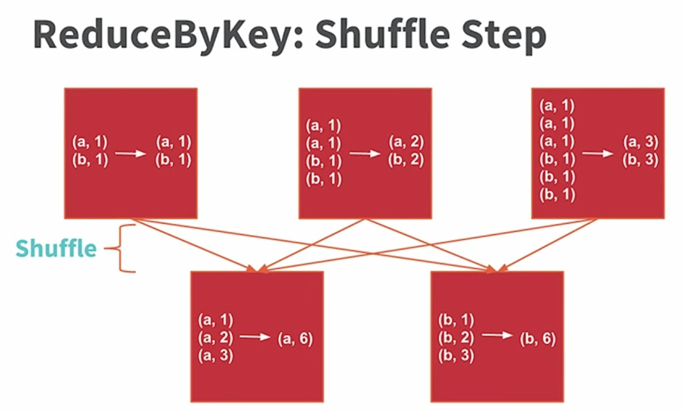
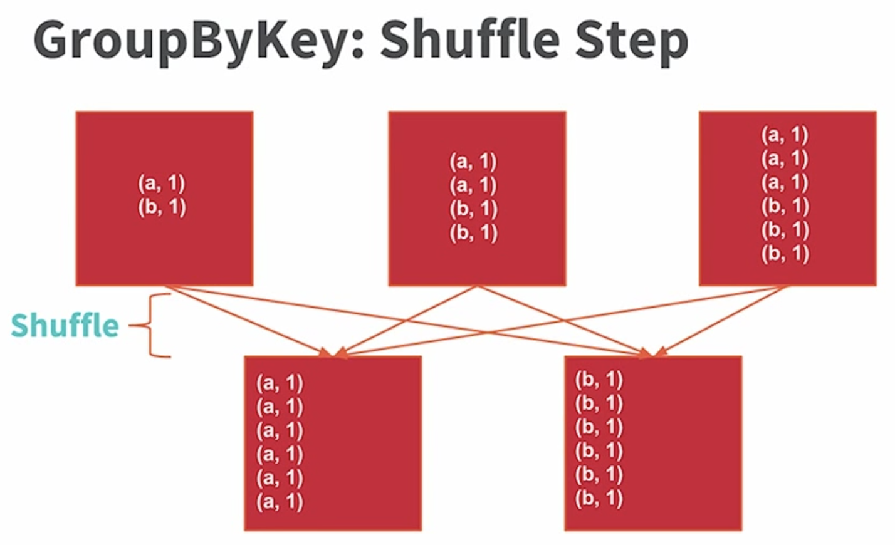

## BigData Platform Spark Task - handle wikipedia dataset

In this task, you will get to know Spark by exploring full-text Wikipedia articles. You are going to use full-text data from Wikipedia to produce a rudimentary metric of how popular a programming language is by counting the number of occurances of each languages in a Wikipedia article. 

### Task 0
* Download the target input file from the below link [http://alaska.epfl.ch/~dockermoocs/bigdata/wikipedia.dat](http://alaska.epfl.ch/~dockermoocs/bigdata/wikipedia.dat)
* After downloading the file, upload the file to the HDFS, and capture the screenshot of `hdfs dfs -ls FILE_PATH` below

### Task 1
You have to implement 5 functions to count the number of occurances of candidate languages. They are `occurrencesOfLang, rankLangs, makeIndex, rankLangsUsingIndex, rankLangsReduceByKey` in `wikipedia/src/main/scala/wikipedia/WikipediaRanking.scala` 
* Implement `occurrencesOfLang` - Start by implementing a helper method which computes the number of articles in an `RDD` of type `RDD[WikipediaArticles]` that mention the given language at least once. For the sake of simplicity we check that it least one word (delimited by spaces) of the article text is equal to the given language.
* Implement `rankLangs` - Using `occurrencesOfLang` implement `rankLangs` that computes a list of pairs where the second component of the pair is the number of articles that mention the language (the first component of the pair is the name of the language). An example of what might return might look like this, for example: List(("Scala",999999),("JavaScript",1278),("LOLCODE",982),("Java",42)). The list should be sorted in descending order.
* Implement `makeIndex` - Compute an inverted index. An inverted index is an index data structure storing a mapping from content, such as words or numbers, to a set of documents. In particular, the purpose of an inverted index is to allow fast full text searches. In our use-case, an inverted index would be useful for mapping from the names of programming languages to the collection of Wikipedia articles that mention the name at least once. To make working with the dataset more efficient and more convenient, implement a method that computes an inverted index which maps programming language names to the Wikipedia articles on which they occur at least once. This function returns an RDD of the following type: `RDD[(String, Iterable(WikipediaArticles)]`. This RDD contains pairs, such that for each language in the given `langs` list there is at most one pair. Furthermore, the second component of each pair (the `Iterable`) contains the `WikipediaArticles` that mention the language at least once. HINT: Hint: You might want to use methods `flatMap` and `groupByKey` on `RDD` for this part
* Implement `rankLangsUsingIndex` - Using `makeIndex` output, implement a faster method for computing the language ranking. Like in `rankLangs` implementation, `rankLangsUsingIndex` should compute a list of pairs where the second component of the pair is the number of articles that mention the language (the first component of the pair is the name of the language). Again, the list should be sorted in descending order. HINT: `mapValues` on `pairRDD` could be useful for this part.
* Implement `rankLangsReduceByKey` - In the case where the inverted index from above is only used for computing the ranking and for no other task, it is more efficient to use the method `reduceByKey` to compute the ranking directly, without first computing an inverted index. Note that the `reduceByKey` method is only defined for RDDs containing pairs (each pair is interpreted as a key-value pair). Implement the method, this time computing the ranking without the inverted index, using `reduceByKey`. Again, the list should be sorted in descending order.

After implementing all the above methods, commit them to your own repository.

### Task 2
In the root folder (under `wikipedia`), run `sbt test` to confirm the compile works and your implemented methods pass the unit test cases. Capture the outcome that says it passes all the test, and embed it below. Note that the captured image should contain the hostname of your test machines.

### Task 3
Build a jar file to submit it in the spark cluster by issuing `sbt package`. The output jar file will be located in `wikipedia/target/scala-2.11/homework-2_2.11-0.1-SNAPSHOT.jar` . Using the file issue `spark-submit` command - `spark-submit --class wikipedia.WikipediaRunner --master spark://node-1:7077 JAR_FILE_LOCATION WIKIPEDIA_INPUT_DATASET_LOCATION` .  Capture the outcome from the execution that contains Language and count list with the running time of each method. Note that the captured image should contain the hostname of your test machines.

### Task 4
Write a report why the three methods - `rankLangs, rankLangsUsingIndex, rankLangsReduceByKey` - of counting shows different performaces. To help you to dig into Spark detail, you can refer articles from web - [Google search result](https://goo.gl/eFzMcm). In the report, you have to write how you interpret and analyze the result by using Spark WebUI - screen capture is highly recommended.

rankLangs의 경우에는 langs을 map(transformation)하여, 이때 각각의 element(lang)과 이 element(lang)을 occurrencesOfLang에 사용하여 (k,v)RDD 타입으로 map해준다. 이때 occurrencesOfLang에서 langs의 element(lang)들은  filter(transformation)된 뒤 count되어 값으로 반환된다. 따라서 [element(lang), 와 occurrencesOfLang(lang)의 리턴값이] (key,value) 형식으로 map되고 이를  sortBy로 descending order 해준다. 이는 List([String,Int]) 형태 이다.

rankLangsUsingIndex의 경우에는 우선 makeIndex를 이용하여 index값을 구해주게 된다.
makeIndex에서는 WikipeaArticle 의 element(news)와 langs의 element(lang)을 이용하여 <key,value>형식(lang 과 그 lang이 나타나는 횟수) 꼴과 매우 유사하지만 다르다.
우선 key는 동일하지만 이때 value는 lang이 나타는 횟수가 아니라 true 값의 집합이다. 이것을 Iterable 하게 만들기 위해서는 groupbyKey가 실행되어야 한다.(이는 CompactBuffer(WikipediaArticle, WikipediaArticle, WikipediaArticle)꼴이다. 따라서 최종적으로 (lang, (article,article))형식이 반환된다. 이것이 index이다. 이것을 rankLangsUsingIndex에서 mapValues을 사용하여 <K,V>RDD형식으로 변환해준다. 그 후 sorting과 collect(action)그리고 toList 하여 최종적으로 우리가 필요로 하는 최종적인List([String,Int])이 된다.

rankLangsReduceByKey는 우선 flatMap을 이용하여 element(article)들을 처리해준다.
이때 flatMap 안에서 element(article)과 langs의 element(lang)을 map 하여 (java,1),(python,1) ...과 같은 flatMap을 만들어 준다. 그 후 rudeceByKey(transformation)를 사용하여 집계를 해주고(key 가 같다면 value를 합쳐준다.) 그 후 sortBy과 collect(action)그리고 toList 하여 최종적으로 우리가 필요로 하는 최종적인 List([String,Int])이 된다.

<보충>
우선 reduceByKey의 경우, 먼저 각 노드에서 중간 집계를 진행하고 이에 대한 결과를 동일한 키 값으로 전송합니다.

반면, groupByKey는 각 노드에 있는 데이터에 대해 바로 Shuffle 과정을 거치게 되고 결과를 내보냅니다. 따라서 groupByKey는 네트워크를 통해 전송되는 데이터의 양이 많아질 뿐만 아니라, Out of disk 문제가 발생할 수도 있습니다.

따라서 이런 오버헤드의 차이 때문에 reduceByKey가 더 우수한 성능을 보입니다.

Ack. The contents and source codes are referenced from [coursera](https://www.coursera.org/learn/scala-spark-big-data/home/welcome)
